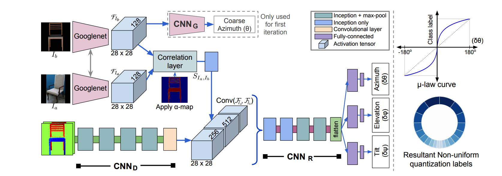

# Network Architecture



# iSPA-Net Training Pipeline

The training pipeline primarily includes the following three training steps:

1) UCN: Training of a Universal Correspondence Network, to get view invariant feature representation, $F_I$, for an image, $I$. Training code, and additional details are available in the folder named *ucn_code*.

2) Viewpoint Classifier Network($CNN_G$): This step involves training a classifier that predicts the azimuth of a given image, $I$, using it's view invariant features, $F_I$. Note that $CNN_G$, is trained by freezing the weights of the UCN weights.  Training code, and additional details are available in the folder named *ucn_code*.

3) Pose Estimator Network($CNN_R$): This step involves training of a pose estimator, that predicts three Euler angles(i.e Azimuth, Elevation, Tilt), given the view invariant feature representation, $F_I$ of an image.  Training code, and additional details are available in the folder named *classifier_code*.

The above three steps must be done after creating the dataset, using the method described in the Data Creation Pipeline('data_creator folder').


# Pose Estimator Network Training

Train this network, after having trained the UCN, and the Viewpoint Classifier Network
```
# set the following config variables in configs/config.py
ispa_net = True
```


```
# set the following config variables in ispa_net_configs/train_config.py
class_name = any one of 'chair'/'sofa'/'bed'/'diningtable'
train_script = 'iterative_train.py'
```

```
# set the following config variable in ispa_net_configs/ucn_config.py
dict_models = {'chair': ['path/to/trained/ucn/for_chair', ''],
             'sofa': ['path/to/trained/ucn/for_sofa', ''],
             'bed': ['path/to/trained/ucn/for_bed', ''],
              'diningtable': ['path/to/trained/ucn/for_diningtable', ''],}
```

```
# run the following to train the pose estimator
python main.py

```


# Pose Estimator Hyperparameters
The hyperparameters used, have been set in the folder ispa-net_configs.

_Note: Please look into the comments in thr files of ispa-net_configs for additional information__


# Pose Estimator Network Testing

Train this network, after having trained the UCN, and the Viewpoint Classifier Network
```
# set the following config variables in ispa_net_configs/test_config.py
class_name = any one of 'chair'/'sofa'/'bed'/'diningtable'
model_to_load = 'path/to/pretrained_model'
```

```
# set the following config variable in ispa_net_configs/ucn_config.py
dict_models = {'chair': ['path/to/trained/ucn/for_chair', ''],
             'sofa': ['path/to/trained/ucn/for_sofa', ''],
             'bed': ['path/to/trained/ucn/for_bed', ''],
              'diningtable': ['path/to/trained/ucn/for_diningtable', ''],}
```

```
# run the following to train the pose estimator
python train_test_scripts/iterative_test.py

```

_Note:_
* For Evaluating the model trained on all classes
	* use the models in pretrained_weights/ispa_net_models/ucn/all/*, for the ucn weights
	* use the models in pretrained_weights/ispa_net_models/classifiers/pascal/all/, for the pose estimator weights.
* For Evaluating the model trained on individual classes
	* use the models in pretrained_weights/ispa_net_models/ucn/[class_name]/*, for the ucn weights.
	* use the models in pretrained_weights/ispa_net_models/classifiers/[dataset]/[class_name]/, for the pose estimator weights.