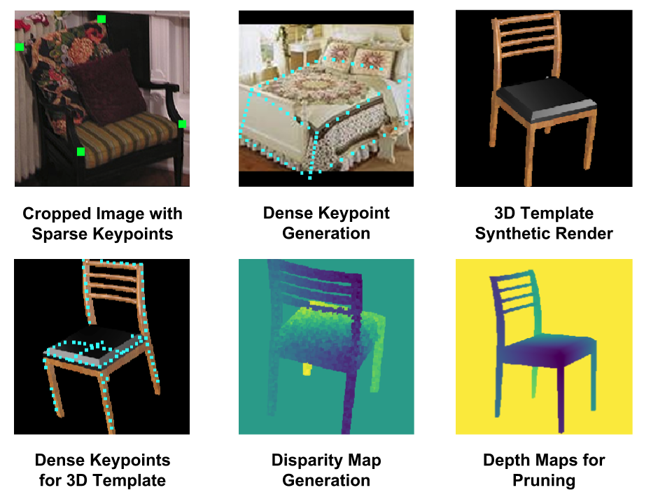

# Data Creation Pipeline

#### Note: Please check the updates at the end of readme.




The data processing pipeline majorly consists of three sub-modules: 

1) Image processing: This include the synthetic image generation and generating cropped images with meta data from the various datasets like Keypoint-5 [link](), Pascal3D+ [link](), and ObjectNet3D [link](). 

2) Dense Keypoint Generation: This consists of generating dense keypoints for all images, along with some noisy pruning algorithms.

3) Disparity Map Generation for Synthetic Images: self-explanatory.

Using blender, we have annotated 10 sparse keypoints for one template 3d model for each of the object classes (namely "chair", "sofa", "bed", "table"). These are used for generating the dense keypoints for synthetic images.

Finally, the processed images, the dense keypoints, and other labels are stored in a LMDB database for faster processing while training.

# Step 0: Pipeline Setup

First and foremost, the datasets have to be downloaded/linked. For data directory related setup, use the following commands:

```
# set the paths in setup.sh
source setup.sh

# to make the folder structure in $data_dir
source setup.sh make_save_dirs

# to download the datasets
source download_datasets.sh

# OR to softlink the datasets
source setup.sh set_soft_links
```
# **TLDR**: 
```
# run these commands pose setting up the paths in global_variables.py and modified_RenderForCNN/global_variables.py
# Crops of real images
source setup.sh generate_all_crops
# Rendering Synthetic Images
python run_render.py
# Preprocessing of Synthetic Images
python preprocess_synthetic_images.py
# generate dense keypoints
source setup.sh generate_all_keypoints
# generate dense keypoints for synthetic images
python make_dense_pointset_syn.py --class_name chair
# generate the auxiliary input disparity maps
python make_disparity_syn.py --class_name chair
# repeat the above two command for the other classes with corresponding class_name
# finally train, val test subsets.
source setup.sh generate_all_splits

```

# Step 1: Image Processing

Image processing is further divided into two parts, synthetic images, and real images.

## Real Images

This consist of simple functions for extracting cropped images from the various datasets, along with the formatted sparse keypoints which are used from the dense keypoint generation. All the images, and the corresponding sparse keypoints are saved in the directories made through `setup.sh`:


```
# The preprocess_real_images.py scirpt can be used with following arguements.
python preprocess_real_images.py --dataset DATASET --class_name CLASS --subset SUBSET

# Functionality for creating the cropped images + sparse keypoints for all classes, all datasets, all sumbsets has been provided:
source setup.sh generate_all_crops

```

## Synthetic Images

For synthetic image generation, we use a modified version of Render-for-CNN ([link]()). This is present in the `modified_RenderForCNN`. The major changes are:

1) Rendering along with the depth information and alpha maps. Depth used in dense keypoint pruning, as well as disparity map generation.

2) Simpler pipeline, and view parameter sampling for matlab independant workflow.

The code for synthetic generation requies various datasets such as `Shapenet`.
```
# set paths in modified_RenderForCNN/global_variables.py 
cd modified_RenderForCNN

# first render the images
python run_render.py

# simple cropping and 0 overlay
python preprocess_synthetic_images.py


```

# Step 2: Dense Keypoint generation

The keypoint generation has different pipeline for the real and the synthetic images. For synthetic images, we perform pruning of occluded points using the depth maps generated along with the image render. For the real-image, we two basic keypoint pruning methods are used. The code for 3D-2D projection and depth-based pruning is from [this]() repository.

## Real Images:
```
# may need to check variables in global_variables.py
python make_dense_pointset.py --dataset DATASET --class_name CLASS_NAME --subset SUBSET

# Functionality for creating the cropped images + sparse keypoints for all classes, all datasets, all subsets has been provided:
source setup.sh generate_all_keypoints

```

## Synthetic Images:
```
python make_dense_pointset_syn.py --class_name CLASS_NAME
```
# step 4: Disparity Map generation

This module is based on the [this]() repository. Find further information in the link.
```
# Functions used are in render_wt_pt_proj
python make_disparity_syn.py --class_name CLASS_NAME
```

# Train, Test and Validation split: 

We make the training,testing, validation split here as well, along with the ground truth annotations:

```
# make the dataset_subset files
# The make_subsets.py scirpt can be used with following arguements.
python make_subsets.py --dataset DATASET --class_name CLASS --subset SUBSET

# Functionality for creating all the splits for all classes, all datasets, all subsets has been provided:
source setup.sh generate_all_subsets
```

# Update:

There were some issues experienced by other users of this repository. The important changes/suggestions according to those issues are listed below:

1) The Anchor Files:
The anchor files for the synthetic models, (which have been manually annotated) were not released with the original repository. Here is the [link](https://drive.google.com/open?id=1_UUmDrM-Bg5KMbHJS-qtiscIsYkWi1_a) to those anchor files. Please use them accordingly. 

2) As found by [@yruoxi](https://github.com/yruoxi) in this issue [#4](https://github.com/val-iisc/pose_estimation/issues/4), the code may fail with some versions of trimesh. Known working version: 2.24.2. (Thank you @yruoxi!). 

