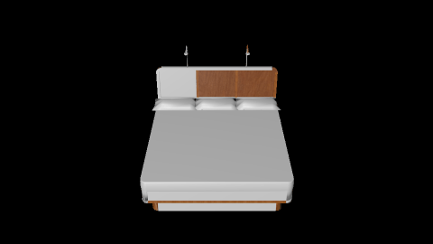
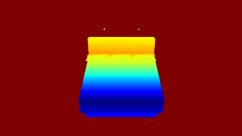
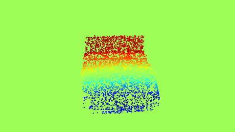
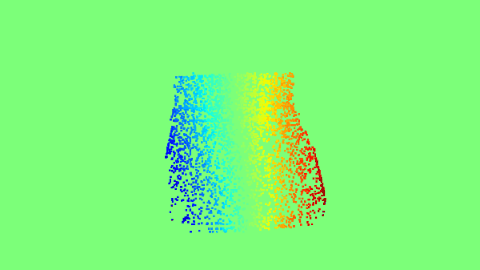

# Render Wt Pt Proj

Code to project 3D keypoints on a model to 2D keypoints on a render of the object. This can be further broken down into two steps:

1) Rendering the 3D object with a given pose with depth map.

2) Projecting the 3D keypoints to 2D keypoints and pruning of points based on depth.

3) Example Utility of this: Computing proxy Optical-FLow maps for 3D models. 


## Example Reel:
| Render| Depth Map|
|----|----|
|| |


| Optical Flow horizontal |Optical Flow Vertical|
|----|----|
| | |

### The Proxy Optical Flow maps.

# Necessary Installations

This project uses [blender](https://www.blender.org/) for the rendering. Python libraries such as **trimesh** and **OpenEXR** are also used. You can install them using:
```
pip install OpenEXR trimesh
```

# 1: Render with depth

The render can be run by using the `run_render.py` script with blender. 
```
blender blank.blend --background --python run_render.py <shape-file> <azimuth> <elevation> <tilt> <distance>
# example
blender blank.blend --background --python run_render.py 02818832/42e4e91343b44d77c3bd24f986301745/model.obj 45 45 0 3
```
This will save the render in the file called `temp.png` and the depth as an `exr` file in `z_map/temp0001.exr`

# 2: Projecting the 3D keypoints

Now, we can project the 3D keypoints to 2D pixel locations based on the blender camera parameters. First get the blender camera's intrinsic matrix using the `get_camera_params.py` file:
```
blender blank.blend --background --python get_camera_params.py
```
From this, the blender camera's intrinsic matrix can be added to `variables.py` file. The default intrinsic matrix is already added.

Now, `run_proj.py` can be used to project the 3D keypoints to 2D projection based on the project parameters.
```
python run_proj.py --shape_file --file <shape-file> --azimuth <azimuth> --elevation <elevation> --tilt <tilt> --distance <distance> 
# example 
python run_proj.py --shape_file --file  02818832/42e4e91343b44d77c3bd24f986301745/model.obj --azimuth 45 --elevation 45 --tilt 0 --distance 3 
```
This will save the file `temp.npy` with the 2D projected points. Additional options, like depth-based pruning, have been provided in the file. Kindly look into the code for such options.

# 3: Example Utility: proxy Optical-Flow maps

There can be multiple applications of the 2D projection of 3D keypoints. One of the applications can be generating proxy Optical-flow maps. We sample random 10000 points on the 3D object, and compare the 3D projections of these points between angles (a,e,t) and (a+10,e+10,t). This can act as the proxy Optical-flow if the object is rotated by 10 azimuth and elevation, when it is rendered at angle (a,e,t).

For getting the proxy Optical-FLow maps, use `get_of.py` file. This will run the render command, and the projection commands, given the view parameters. It can be used as shown below:
```
python get_of.py --shape_file <shape-file> --azimuth <azimuth> --elevation <elevation> --tilt <tilt> --distance <distance>  
# example 
python get_of.py --shape_file  02818832/42e4e91343b44d77c3bd24f986301745/model.obj --azimuth 45 --elevation 45 --tilt 0 --distance 2
```  

# But Why?

I was using this in my research work, and felt that this might be a good,generalizable tool that others can use as well!

# Acknowledgements

I would like to thank:

* creators of [RenderForCNN](https://github.com/ShapeNet/RenderForCNN)

* creators of [Blender](https://www.blender.org/)

* [rfabbri](https://blender.stackexchange.com/users/16590/rfabbri) for answering questions at Blender Stackexchange.
