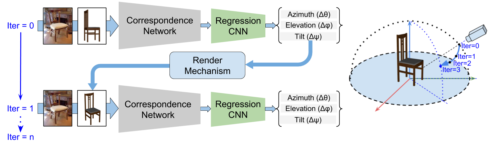

# Template-Model Driven Pose Estimation


This repository contains the code for our works:
 1) **iSPA-NET**, accepted in ACM Multimedia Conference, 2018 (ACMMM18) - *Jogendra Nath Kundu, *Aditya Ganeshan, *Rahul MV, Aditya Prakash, R. Venkatesh Babu




 2)  **Object Pose Estimation Using Multi-View Keypoint Correspondence**, accepted in Geometry Meets Deep Learning Workshop, at ECCV 2018. - *Jogendra Nath Kundu, *Rahul MV, *Aditya Ganeshan, R. Venkatesh Babu


###### \* = equal Contribution

This repository is broadly consists of:

1) Data Creation : [data_creator](https://github.com/val-iisc/iSPA-Net/tree/master/data_creator)

2) Universal Correspondence Network Training Code : [ucn_code](https://github.com/val-iisc/iSPA-Net/tree/master/ucn_code)

3) iSPA-Net Training and Testing code : [classifier_code](https://github.com/val-iisc/iSPA-Net/tree/master/classifier_code)
	 - Refer to classifiercode/iSPA-Net.md for more details

4) Multi-View Keypoint based Pose Estimation - Training and Testing code : [classifier_code](https://github.com/val-iisc/iSPA-Net/tree/master/classifier_code)
	- Refer to classifiercode/Multi-View-Net.md for more details


**Note:** For the Universal Correspondence Network, caffe code for which has to be requested from [NEC-Labs](http://www.nec-labs.com/~mas/UCN/).

Link to Arxiv: [1808.01134](https://arxiv.org/abs/1808.01134)

## Citation
```
@article{ispanet-kundu-2018,
title={iSPA-Net: Iterative Semantic Pose Alignment Network},
author={Kundu, Jogendra Nath and Ganeshan, Aditya and MV, Rahul and Prakash, Aditya and Babu, R Venkatesh},
booktitle = {arXiv preprint arXiv: 1808.01134 },
year = {2018}
}
```

