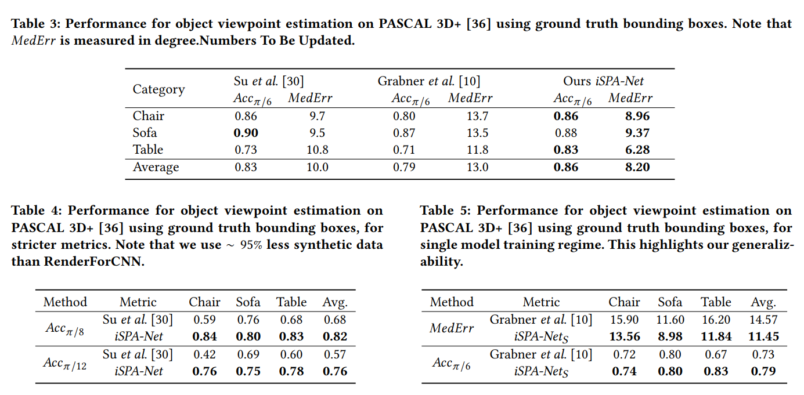

# iSPA-Net: Iterative Semantic Pose Alignment Network.

*Jogendra Nath Kundu, *Aditya Ganeshan, *Rahul Venkk, Aditya Prakash, R. Venkatesh Babu

* = equal Contribution

This repository contains the code for our work **iSPA-NET**, accepted in ACM Multimedia Conference, 2018 (ACMMM18).

This repository is broadly divided into two parts:

1) Data Creation: **Ready**

2) iSPA-Net Training and Testing code: **T.B.A.**

**Note:** For the Universal Correspondence Network, code for which has to be requested from [NEC-Labs](http://www.nec-labs.com/~mas/UCN/).

Link to Arxiv:

## Citation

## Acknoledgement

Parts of code are yet to be cleaned and added!

Stay tuned for more!

 
